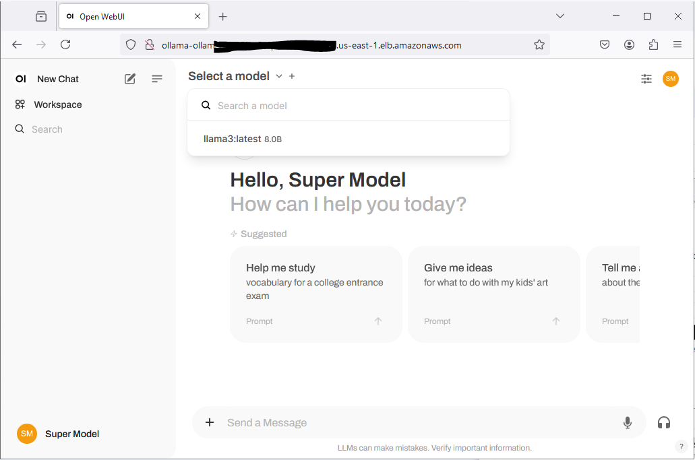

# Run Ollama on AWS

Here, we demonstrate deoployment of Ollama on AWS EC2 Server.  This is a use case that many are trying to implement so that LLMs are run locally on their own servers to keep data private.  

In addition to Ollama, we also install Open-WebUI application for visualization. These 3rd party products are all deployed on an AWS EC2 server, run as Docker containers and exposed using AWS ALB.  The application also includes Llama3 LLM model as default.

This application is developed using AWS CDK in TypeScript.

## What does it build?
* Creates an EC2 Server and deploys Ollama server
* Installs Llama3 LLM for use on Ollama server
* Installs and Configures Open-WebUI application to communicate with Ollama server
* Creates an AWS ALB to expose the Web application

## Steps to run and test
* Deploy the CDK code. Wait for the deploy to finish.  It will print out the Website endpoint for you to use.
  * 
* Select the Llama3 Model for use.
  * 
* Play with the model
  * 

## References
* [Ollama](https://ollama.com/)
* [Open Web UI](https://openwebui.com/)

## Few notes
* This is just a POC to show that Ollama can be run on a Virtual Server on AWS and exposed with an UI.  Additional configurations are required for operationalizing this Open Web UI application.
* This is an expensive solution as I am using `c7i.2xlarge` instance image.  You should look into [AWS Inferentia] (https://aws.amazon.com/machine-learning/inferentia/) images instead.

* _I recommend that we use [AWS Bedrock](https://aws.amazon.com/bedrock/) instead_